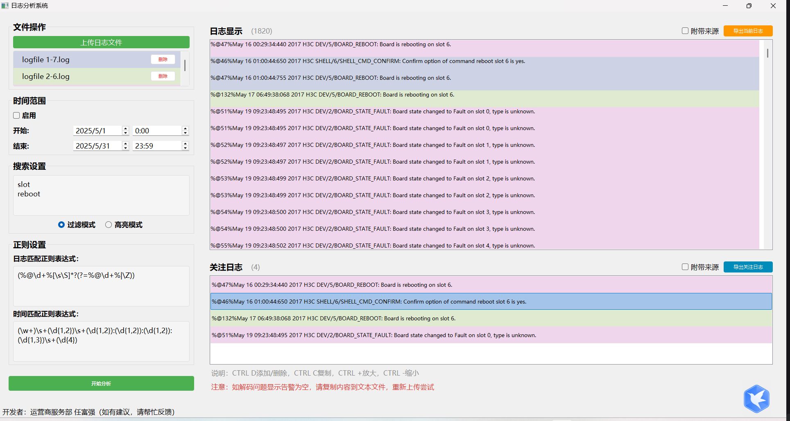
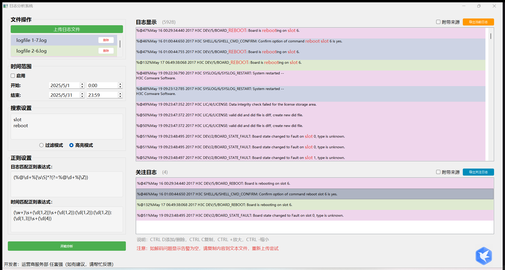

# 日志分析系统（PyQt5）

一个面向本地日志文件的可视化分析工具，支持多文件上传、正则解析、时间范围过滤、关键词过滤/高亮、关注列表、导出与快捷键操作。采用分页虚拟滚动保证大量日志的流畅显示。

## 目录结构与架构

- app/
  - main_window.py
    - 应用主窗口与 UI 逻辑：
      - 文件操作区（上传/文件列表/删除按钮）
      - 时间范围设置（启用/起止日期时间）
      - 搜索设置（过滤模式/高亮模式、关键词输入）
      - 正则设置（日志条目正则、时间正则）
      - 日志显示区与关注日志显示区（分页虚拟滚动）
      - 导出当前日志/导出关注日志
      - 快捷键支持、事件过滤器、字号调整
      - 与 LogProcessor/HighlightDelegate 的集成
  - log_processor.py
    - 日志处理核心：
      - 解析日志文件内容（多编码自动识别）
      - 使用用户或默认正则切分日志条目
      - 提取时间戳并生成 LogEntry
      - 时间范围过滤、关键词过滤（支持正则/大小写不敏感）
      - 并行处理与进度回调
  - highlight_delegate.py
    - 自定义委托，高亮日志显示中的关键词：
      - 逐行绘制并在不改变字符位置的前提下高亮片段
      - 保留右侧复选框区域
  - utils.py
    - 工具函数与数据结构：
      - LogEntry（namedtuple）
      - generate_light_colors（文件来源背景色）
      - parse_log_time（健壮的时间字符串解析）

## 主要特性

- 多文件上传，保留已上传列表，独立删除按钮（右对齐，美观友好）
- 可配置的日志条目与时间正则，容错回退
- 时间范围过滤（可启用/关闭）
- 两种搜索模式：
  - 过滤模式：仅显示包含关键词的日志
  - 高亮模式：所有日志显示，命中关键词高亮，不改变原位置
- 关注日志（可勾选/取消），支持导出并保持显示顺序
- 当前显示日志导出（可附带来源文件名）
- 分页虚拟滚动，规模大时仍保持流畅
- 快捷键：
  - 主列表：Ctrl+D 添加/删除关注、Ctrl+C 复制、Ctrl+/- 调整字号
  - 关注列表：Ctrl+D 删除选中、Delete/Backspace 删除选中
- 文件来源浅色背景，便于区分




## 环境要求

- Python 3.9+（推荐）
- 依赖：
  - PyQt5
  - charset-normalizer（编码自动检测，优先使用）
  - chardet（编码自动检测回退）
- 可选：basedpyright（静态检查，仅开发用；部分 PyQt 绑定会误报）

## 安装

```bash
pip install -U pip
pip install PyQt5 charset-normalizer chardet
```

如使用 requirements.txt，请加入：
```
PyQt5
charset-normalizer
chardet
```

## 运行

```bash
python -m app.main_window
```

或在自定义入口脚本中实例化 LogAnalyzerApp 并调用 show()。

## 使用指南

1. 上传日志文件（支持 .txt/.log 等文本文件）
2. 配置“日志匹配正则”和“时间匹配正则”（默认为内置模式）
3. 可启用“时间范围”，设置起止日期与时间
4. 在“搜索设置”输入关键词（每行一个），选择“过滤模式”或“高亮模式”
5. 点击“开始分析”
6. 在主日志区：
   - 勾选项会进入“关注日志”
   - 支持快捷键（Ctrl+D 添加/删除关注，Ctrl+C 复制，Ctrl+/- 调整字号）
7. 在关注日志区：
   - Ctrl+D 或 Delete/Backspace 删除选中
8. 可导出当前显示/关注日志（可选附带来源）

## 近期优化

- 高亮模式定位偏移修复：
  - 高亮绘制逻辑保证不改变原字符位置，仅改变颜色/样式
- 编码解析增强：
  - 引入 charset-normalizer → chardet → 手动编码列表 的三级检测流程，显著提升解析成功率
- 文件操作区 UI 优化：
  - 删除按钮右侧对齐但独立显示，固定尺寸与悬停高亮；增加右侧内边距避免贴边
- 关注列表快捷键增强：
  - 新增 Ctrl+D 直接删除选中关注项，并同步主列表勾选状态

## 正则与时间解析

- 日志条目正则默认：
  - `(%@\d+%[\s\S]*?(?=%@\d+%|\Z))`
- 时间匹配默认：
  - `(\w+)\s+(\d{1,2})\s+(\d{1,2}):(\d{1,2}):(\d{1,2}):(\d{1,3})\s+(\d{4})`
- 时间解析支持英文月份缩写（Jan-Dec），失败时记为 None 并在过滤时跳过

## 常见问题

- 无法解析部分文件：
  - 请确认已安装 charset-normalizer 与 chardet
  - 若仍失败，尝试将文件另存为 UTF-8 再上传
- 高亮未生效或效果异常：
  - 检查搜索关键词是否正确（每行一个）
  - 关键词中包含正则特殊符号时会按正则处理
- 静态检查误报：
  - 基于 PyQt5 的动态绑定，类型检查器可能报错，但不影响运行

## 许可与鸣谢

- 本项目依赖 PyQt5、charset-normalizer、chardet 等开源软件
- 开发者：运营商服务部 任富强
- 欢迎反馈建议以持续优化体验